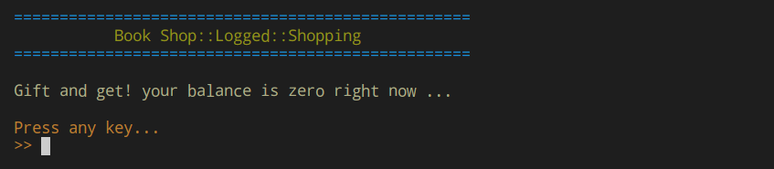

# فروشگاه کتاب

این برنامه یک شبیه ساز فروشگاه کتاب می باشد که در بستر پایتون و با کمک بانک اطلاعاتی پستگره پیاده سازی شده است. همچنین این پروژه به برخی پیش نیازهای دیگر نیز وابسته است که لیست آن ها در فایل requirements.txt درج شده است.

[استفاده از پروژه](#چگونه-از-آن-استفاده-کنیم)     
[هدف از پیاده سازی این پروژه](#چه-ایده-ای-را-دنبال-می-کند)           
[کمی در مورد منطق کاری برنامه](#چگونه-کار-می-کند)

## چگونه از آن استفاده کنیم
برای استفاده از این پروژه کافی است تا محتویات پروژه را در سیستم خود کپی کرده و فایل main را اجرا کنید. توجه داشته باشید که نصب بودن بانک اطلاعاتی پستگره در سیستم عامل شما الزامی است.

## چه ایده ای را دنبال می کند
ایده اصلی این بوده که نحوه کار با بانک اطلاعاتی پستگره از طریق MRO ساخته شده توسط خود کاربر بررسی و آزمایش شود که البته جهت تکمیل شدن این ایده سعی شده پروژه در قالب یک برنامه کامل کدنویسی و آماده گردد. 

نکته جالبی که در این برنامه باید به آن توجه کنید، مدل تجاری حاکم بر این فروشگاه می باشد به این صورت که هر کاربری تنها و تنها از طریق اهدای کتاب به فروشگاه می تواند از امتیاز خرید برخوردار شود و هر خرید نیز موجب کسر یک امتیاز خواهد شد. بنابراین این ایده در واقعیت یک ساختار دایمی ایجاد کرده و مانند رشد سلول های بدن، موجودی کتاب های فروشگاه تکثیر خواهند شد زیرا حق امتیاز بهره مندی از این فروشگاه فقط با اهدای کتاب به دست خواهد آمد. من شعار زیر را برای این مدل انتخاب کرده ام:

GIft and get!

## چگونه کار می کند
پس از اجرای پروژه، بررسی می شود که آیا بانک اطلاعاتی و جداول مورد نیاز که شامل جدول یوزرها، جدول کالاها و جدول کامنت ها می باشد بر روی سیستم وجود دارد یا خیر. در صورتی که جواب این سوال خیر باشد، برنامه به صورت خودکار ساختار مورد نیاز را بازسازی کرده و زمینه را برای ادامه اجرا فراهم می کند.

در این پروژه از چند ایده و تکنولوژی مختلف کمک گرفته شده است تا تجربه نزدیک تر به واقعیت را برای کاربران فراهم کند. در گام نخست برای هر کاربری که در سیستم ثبت نام کند یک کلید انحصاری تولید شده و در دیتابیس ذخیره می گردد. این کلید انحصاری در دو مورد مورد استفاده قرار می گیرد که عبارت اند از:

+ رمز نگاری داده های مربوط به کاربر: هر کتابی که توسط کاربر به فروشگاه اضافه شود، محتویات آن با کمک کلید انحصاری همان کاربر رمزنگاری شده و سپس در دسترس عموم قرار می گیرد. بنابراین در هر لحظه فقط مالک فایل به کلید رمزگشایی دسترسی خواهد داشت. این روند به صورت مستمر ادامه خواهد داشت و هرگاه که کتاب توسط مشتری جدیدی خریداری شود، فایل رمزگشایی شده و سپس توسط کلید انحصاری کاربر جدید رمزنگاری خواهد شد.

+ بازیابی رمز عبور: رمز های عبور در این پروژه برای فراهم کردن امنیت به هیچ وجه به صورت خام در بانک اطلاعاتی ذخیره نمی شوند بلکه این رمز های عبور توسط الگوریتم sh1 هش شده و به عنوان یک گام امنیتی بیشتر با پسورد بانک اطلاعاتی جمع می شوند تا در مجموع دو لایه امنیتی مختلف فراهم شود. طبیعتا در این شرایط اگر کاربر بخواهد به بازیابی رمز عبور اقدام کند، به یک مرحله اعتبار سنجی نیاز دارد که این اعتبار سنجی از طریق کلید انحصاری او انجام خواهد شد.

مورد دیگری که پیش تر نیز به آن اشاره شد، منطق تجاری برنامه می باشد به این نحو که اعتبار حساب هر کاربر تنها از طریق هدیه کتاب به فروشگاه افزایش پیدا می کند و البته با هر خرید نیز یک واحد از این اعتبار کاسته خواهد شد. کاربری که اعتباری نداشته باشد نمی تواند از مزایایی نظیر خرید کتاب، ثبت کامنت و یا بررسی کامنت های ثبت شده بهره مند شود. البته بررسی موجودی کتاب های فروشگاه برای همه افراد فراهم است و گزینه بررسی بدون مزایا همواره در اجرای برنامه و از طریق منوی explore در دسترس مشاهده کنندگان قرار دارد.

